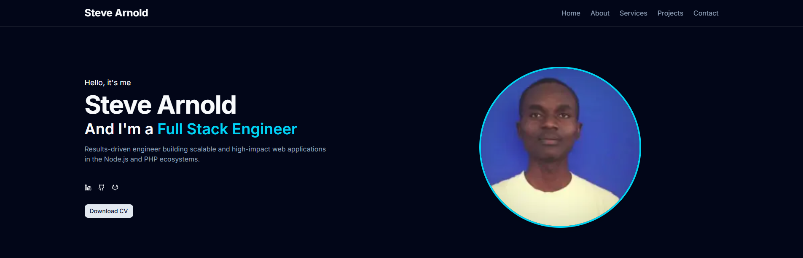

# Steve Arnold Otieno - Portfolio v2.0



This is the second iteration of my professional portfolio, built from the ground up to showcase my skills in modern, full-stack web development. The project is designed to be a clean, performant, and fully-responsive single-page application that details my professional experience, skills, and projects.

### [➡️ View Live Demo](https://portfolio-sand-beta-k0qdjldsy3.vercel.app/) 


---

## ✨ Features

*   **Modern & Responsive Design:** Built with Tailwind CSS and `shadcn/ui` for a beautiful, consistent UI across all devices.
*   **Interactive UI:** Features smooth scrolling, a typing animation in the hero section, and interactive modals for service details.
*   **Services Showcase:** A detailed look at my key offerings, with "Read More" buttons that trigger dynamic modal windows.
*   **Projects Section:** A clean, card-based layout to showcase my most relevant work, with direct links to the source code on GitHub.
*   **Functional Contact Form:** A fully-functional contact form with client-side validation (React Hook Form & Zod) that sends beautifully designed emails using **Resend** and **React Email**.
*   **Professional Architecture:** The codebase is highly organized, separating data, types, and components for maximum maintainability and scalability.
*   **SEO & Metadata:** Optimized for search engines and social sharing with full Open Graph (og:image) and favicon support.

---

## 🛠️ Tech Stack

This portfolio is built with a modern, professional tech stack to demonstrate my expertise in the current development landscape.

*   **Framework:** [Next.js](https://nextjs.org/) (App Router)
*   **Language:** [TypeScript](https://www.typescriptlang.org/)
*   **Styling:** [Tailwind CSS](https://tailwindcss.com/)
*   **UI Components:** [shadcn/ui](httpss://ui.shadcn.com/)
*   **Form Management:** [React Hook Form](https://react-hook-form.com/) & [Zod](https://zod.dev/)
*   **Email Service:** [Resend](https://resend.com/)
*   **Email Templates:** [React Email](https://react.email/)
*   **Icons:** [Lucide React](https://lucide.dev/)
*   **Notifications:** [Sonner (Toast)](https://sonner.emilkowal.ski/)
*   **Deployment:** [Vercel](https://vercel.com/)

---

## 🚀 Running Locally

To run this project on your local machine, follow these steps:

1.  **Clone the repository:**
    ```bash
    git clone https://github.com/Arnoldsteve/Portfolio.git
    cd Portfolio
    ```

2.  **Install dependencies:**
    This project uses `pnpm` as the package manager.
    ```bash
    pnpm install
    ```

3.  **Set up environment variables:**
    Create a file named `.env.local` in the root of the project and add your Resend API key.
    ```
    RESEND_API_KEY=your_resend_api_key_goes_here
    ```

4.  **Run the development server:**
    ```bash
    pnpm dev
    ```

Open [http://localhost:3000](http://localhost:3000) in your browser to see the result.

---

## ☁️ Deployment

This project is configured for seamless deployment on [Vercel](https://vercel.com/). The `main` branch is automatically deployed to production.

---

## 📜 License

This project is licensed under the MIT License. See the `LICENSE` file for details.

---

## 📬 Contact

*   **Steve Arnold Otieno**
*   **Email:** stevearnold9e@gmail.com
*   **LinkedIn:** [linkedin.com/in/ysteve-arnold-otieno](https://www.linkedin.com/in/steve-arnold-otieno) 