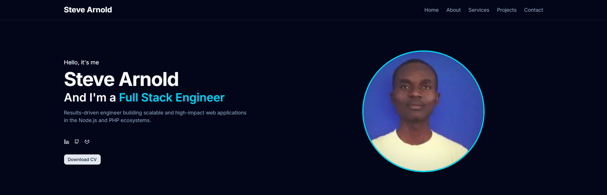

# Steve Arnold Otieno — Portfolio v3.0 (Digital Twin AI)



> **v3.0 represents a fundamental shift** — from a static portfolio to an **Autonomous Technical Twin**. Built on an enterprise-grade speed stack, it features a proactive AI agent that conducts real-time technical screenings, explains architectural decisions, and surfaces direct evidence from my GitHub, LinkedIn, and live production environments.

### [➡️ View Live Agent & Portfolio](https://steve-arnold.vercel.app/)

---

## ✨ Engineering Highlights (V3 Evolution)

- **Proactive AI Technical Twin:** A bi-directional agent powered by Groq (Llama 3.3) and WebSockets. It monitors user intent and proactively offers contextual deep-dives — e.g. *"I see you're looking at GradeHub; want to know how I handled multi-tenant RBAC?"*
- **Enterprise RAG Pipeline:** A custom Retrieval-Augmented Generation engine backed by Neon (PostgreSQL + pgvector), performing semantic search across my entire professional history for 100% factual accuracy.
- **Automated Knowledge Ingestion:** A modular ETL pipeline that auto-syncs from:
  - **GitHub** — real-time README scraping and technical metadata extraction
  - **LinkedIn** — standardised career history via PDF-parsing
  - **Live Web** — recursive crawling of production sites for brand consistency
- **Local Inference Engine:** High-performance vector embeddings generated on-server with Xenova Transformers (`all-MiniLM-L6-v2`) — zero API cost, zero-latency vectorisation.
- **The Shield (Rate Limiting):** Context-aware throttling via NestJS Throttler protecting both HTTP and WebSocket layers from bot spam.

---

## 🛠️ Tech Stack

### Frontend
| Layer | Technology |
|---|---|
| Framework | [Next.js 15+](https://nextjs.org/) (App Router) |
| Real-time UI | Socket.io-client & [Framer Motion](https://www.framer.com/motion/) |
| Rich Media | React Markdown with GFM support |
| Design | [Tailwind CSS](https://tailwindcss.com/) & [shadcn/ui](https://ui.shadcn.com/) |
| Forms | [React Hook Form](https://react-hook-form.com/) & [Zod](https://zod.dev/) |
| Email | [Resend](https://resend.com/) & [React Email](https://react.email/) |
| Icons | [Lucide React](https://lucide.dev/) |
| Notifications | [Sonner](https://sonner.emilkowal.ski/) |

### Backend
| Layer | Technology |
|---|---|
| Framework | [NestJS](https://nestjs.com/) (Modular Architecture) |
| AI Inference | Groq Cloud LPU — Llama 3.3 70B |
| Vector DB | [Neon](https://neon.tech/) with pgvector |
| ORM | [Drizzle ORM](https://orm.drizzle.team/) (type-safe migrations) |
| Ingestion | Playwright (headless scraping) & pdf-parse |

### Infrastructure
| Layer | Technology |
|---|---|
| Containerisation | Docker (multi-stage builds) |
| Hosting | AWS EC2 (t3.micro) + Nginx reverse proxy |
| CI/CD | GitHub Actions — automated deployment & model pre-caching |
| Frontend Deploy | [Vercel](https://vercel.com/) |

---

## 📂 Repository Structure

```
steve-portfolio-v3/
├── client/                 # Next.js Frontend → Vercel
│   ├── src/hooks/          # Custom AI & Socket hooks
│   └── src/services/       # Singleton Socket management
├── server/                 # NestJS Backend → AWS EC2
│   ├── src/modules/        # Modular AI, Vector, and Chat domains
│   ├── src/scripts/        # Knowledge seeding and ETL scripts
│   └── Dockerfile          # High-performance production image
└── infra/                  # Nginx & SSL configurations
```

---

## 🚀 Running Locally

This is a monorepo managed with `pnpm`.

**1. Clone the repository:**
```bash
git clone https://github.com/Arnoldsteve/Portfolio.git
cd steve-portfolio-v3
```

**2. Server setup:**
```bash
cd server
pnpm install
# Add GROQ_API_KEY and DATABASE_URL to .env
pnpm db:push     # Run Drizzle migrations
pnpm seed        # Initialise AI memory
pnpm start:dev
```

**3. Client setup:**
```bash
cd client
pnpm install
# Add RESEND_API_KEY to .env.local
pnpm dev
```

Open [http://localhost:3000](http://localhost:3000) to see the result.

---

## ☁️ Deployment

- **Frontend:** The `client/` directory deploys automatically to [Vercel](https://vercel.com/) on every push to `main`.
- **Backend:** The `server/` directory is containerised via Docker and deployed to AWS EC2 through a GitHub Actions CI/CD pipeline.

---

## 📜 License

This project is licensed under the MIT License. See the `LICENSE` file for details.

> This project follows [Conventional Commits](https://www.conventionalcommits.org/) and SOLID design principles. For an interactive technical deep-dive, talk to the AI Twin on the live site.

---

## 📬 Contact

**Steve Arnold Otieno** — Solutions Architect & Full-Stack Engineer

- **Email:** stevearnold9e@gmail.com
- **LinkedIn:** [linkedin.com/in/steve-arnold-otieno](https://www.linkedin.com/in/steve-arnold-otieno)
